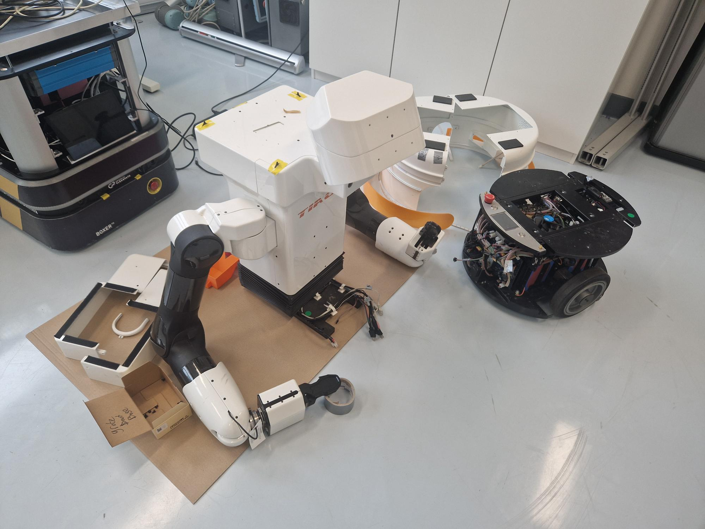
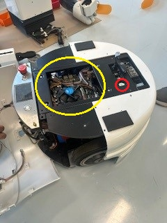

Hardware
========

There might also be a hardware issue on Tiago. It is possible to remove the torso from the base. In the base are all the main hardware components located.

Below a small instruction on how to disassemble Tiago:

1. First remove the cover on top of the base.
2. There are four bolts that hold the torso on the base. Remove those bolts.

.. image:: torso.jpg
   :width: 240px
   :height: 320px
   :scale: 100 %
   :align: center

3. The torso can be placed on a soft surface.
4. Remove all the cover of the base. 
5. On this image, you see the motherboard circled in yellow. In red, the BIOS battery is located.

6. The fuses are located at the back. See the image below, marked in red:

.. image:: fuse.jpg
   :width: 240px
   :height: 320px
   :scale: 100 %
   :align: center