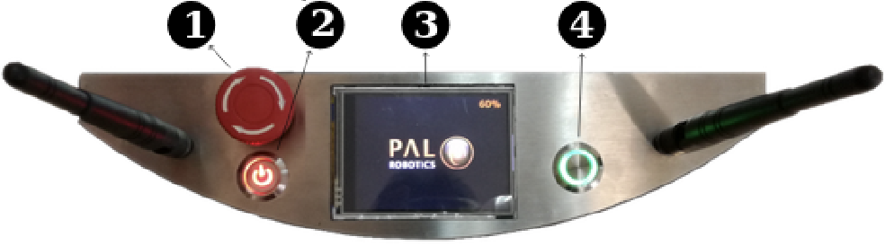

Using TiagoDual
===============

Start Up
--------
Tiago has been ported to ROS2, this has lead to some changes, but not for starting the tiago. Make sure that the Tiago is in a free space when turning on. Due to the fact that the torso might go up and the arms will move. 

	1. Unrelease the emergency button (1)
	2. Press the power switch. It will turn red when it is on (2)
	3. Hold the on/off button (green) for 1 second (4) 

The green button has three indicators with different modes described below:

	- When the state is fixed, the robot is running
	- When the state is slow-blink, the robotsystem is booting or shutting down
	- When the state is fast-blink, the emergency button is pressed 

After roughly a minute, the robot will be booted up. The orange sensors on the base will be activated and the torso will go up. This is the sign that the robot is booted up correctly.

Network
-------

The Tiago has a WiFi network called 'tiago-dual-115-Hotspot', and the default password is now 'PAL-H0tsp0t'. You can also connect the Tiago via an ethernet cable at the torso. The IP addresses are listed below. When you are connected and typing the IP address in a web browser, you will see the web interface of the Tiago. 

It is also possible to ssh in the Tiago. First make sure you are connected. Type in the terminal the following:

..code-block::

  ssh pal@<IP-address>

The password is *pal*. To log in as root, type:

..code-block::

  ssh root@<IP-address>

The password is *palroot*

======== ==========
	 IP address
======== ==========
WiFi	 10.42.0.1
Ethernet 10.68.0.1
======== ==========
